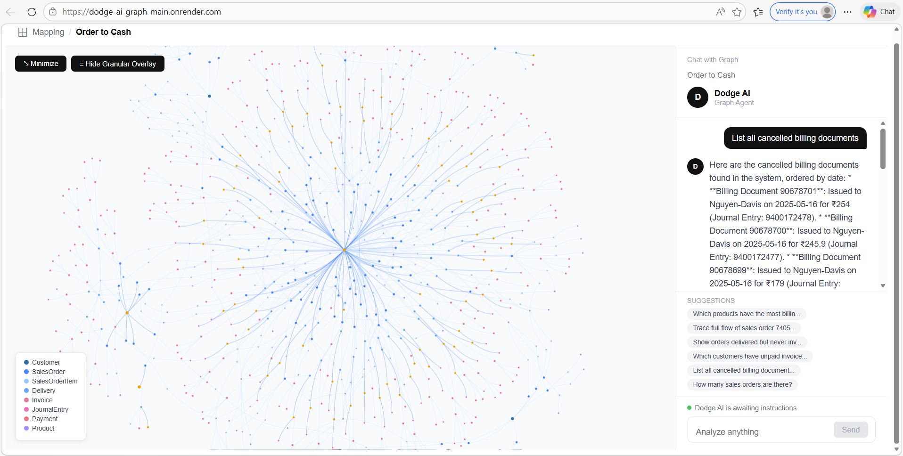
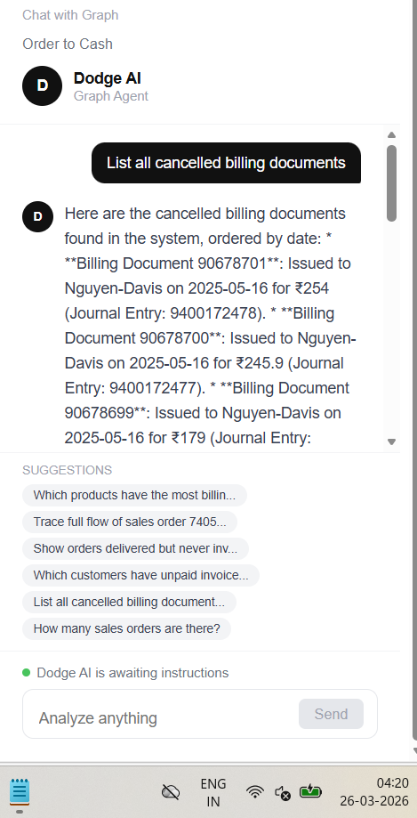
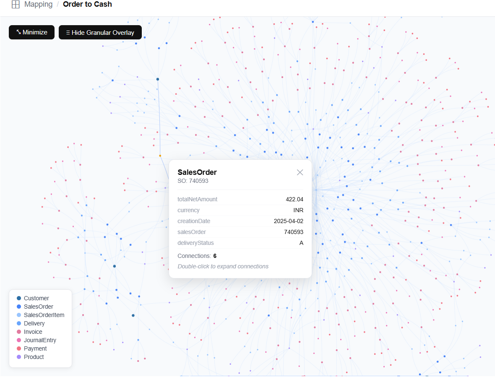
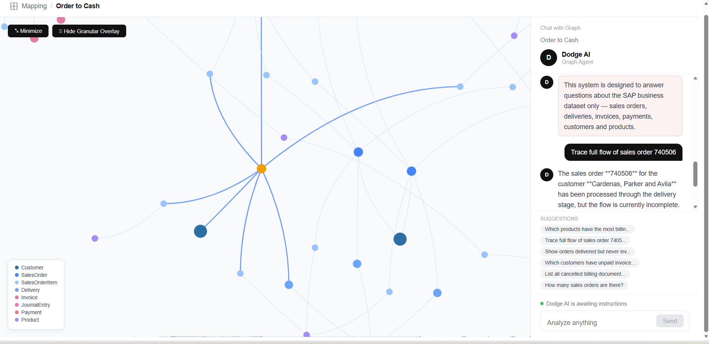

# Dodge AI — SAP Order-to-Cash Graph Explorer

> Forward Deployed Engineer Assignment — Graph-Based Data Modeling and Query System


**Live Demo:** https://dodge-ai-graph-main.onrender.com  
**Backend API:** https://dodge-ai-graph-osxx.onrender.com  
**GitHub:** https://github.com/manas541/dodge-ai-graph

---

## Screenshots

### Graph Explorer


### AI Chat Interface  


### Node Inspection


### Query


## Overview

In real-world business systems, data is spread across multiple entities —
orders, deliveries, invoices, and payments — with no clear way to trace
how they connect.

This system solves that by:

1. Ingesting the SAP Order-to-Cash dataset and unifying it into a
   **directed graph of interconnected business entities**
2. Providing an **interactive visual graph** for exploring relationships
3. Offering a **natural language chat interface** powered by Google Gemini
   that translates questions into SQL, executes them, and returns
   data-backed answers
4. Detecting **broken or incomplete business flows** automatically

This is not a static Q&A system. Every answer is grounded in live data
retrieved from the database — nothing is hallucinated.

---

## Architecture
```
┌──────────────────────────────────────────────────────────┐
│                  React Frontend (Vite)                    │
│                                                           │
│  ┌───────────────────────┐  ┌───────────────────────────┐ │
│  │     Graph Viewer      │  │       AI Chat Panel       │ │
│  │     (vis-network)     │  │     (Gemini powered)      │ │
│  │                       │  │                           │ │
│  │  • 841 nodes          │  │  • Natural language input │ │
│  │  • 1012 edges         │  │  • SQL transparency       │ │
│  │  • Click → inspect    │  │  • Data table viewer      │ │
│  │  • Double-click       │  │  • Conversation memory    │ │
│  │    → expand neighbors │  │  • Guardrails             │ │
│  │  • Filter by type     │  │  • Node highlighting      │ │
│  └───────────────────────┘  └───────────────────────────┘ │
└────────────────────────┬─────────────────────────────────┘
                         │ REST API
┌────────────────────────▼─────────────────────────────────┐
│              Spring Boot Backend (Java 17)                │
│                                                           │
│  DataLoader          GraphService         GeminiService   │
│  ───────────         ────────────         ──────────────  │
│  Reads  JSONL  →   JGraphT in-memory →  NL → SQL →        │
│  folders             directed graph       Execute →       │
│  Inserts into        8 node types         NL Answer       │
│  PostgreSQL          7 relationship       + Guardrails    │
│                      types                + Memory        │
│                                                           │
│  ┌─────────────────────────────────────────────────────┐  │
│  │                   PostgreSQL                        │  │
│  │   14 tables • 1,200+ records • SAP O2C dataset      │  │
│  └─────────────────────────────────────────────────────┘  │
└────────────────────────┬─────────────────────────────────┘
                         │ HTTPS
              ┌──────────▼───────────┐
              │  Google Gemini API   │
              │  gemini-3.1-flash    │
              │  Free tier           │
              └──────────────────────┘
```


## Why This Architecture

The core insight is that SAP O2C data is **relational at rest but
graph-shaped in queries**. A customer asking "trace order 740506" is
really asking for a multi-hop graph traversal. But a customer asking
"top 5 customers by revenue" is a pure SQL aggregation.

This led to a hybrid approach:
- PostgreSQL stores and aggregates data efficiently
- JGraphT provides graph traversal in memory
- Gemini generates SQL dynamically (not Cypher) because SQL is
  more reliable for LLM generation and covers 95% of business queries
- The graph visualization layer uses the in-memory JGraphT to serve
  node neighborhoods instantly without hitting the database
---

## Tech Stack

| Layer       | Technology               | Why This Choice                              |
|-------------|--------------------------|----------------------------------------------|
| Backend     | Spring Boot 3 (Java 17)  | Production-grade, excellent JDBC support     |
| Database    | PostgreSQL               | Complex JOINs, relational data fits SAP O2C  |
| Graph Layer | JGraphT                  | In-memory graph, zero latency traversal      |
| LLM         | Google Gemini 1.5 Flash  | Best free tier, excellent SQL generation     |
| Frontend    | React 18 + Vite          | Fast dev, component-driven architecture      |
| Graph UI    | vis-network              | Physics-based layout, interactive            |
| HTTP        | Axios                    | Clean REST calls with interceptors           |
| Deploy      | Render + Docker          | Free tier, auto-deploy from GitHub           |

---


## Dataset

SAP Order-to-Cash dataset — 15 entity types in JSONL format:

| Folder                                         | Records | Table in DB                          |
|------------------------------------------------|---------|--------------------------------------|
| sales_order_headers                            | 100     | sales_order_headers                  |
| sales_order_items                              | 167     | sales_order_items                    |
| outbound_delivery_headers                      | 86      | outbound_delivery_headers            |
| outbound_delivery_items                        | 137     | outbound_delivery_items              |
| billing_document_headers                       | 163     | billing_document_headers             |
| billing_document_items                         | 245     | billing_document_items               |
| billing_document_cancellations                 | 80      | billing_document_cancellations       |
| payments_accounts_receivable                   | 120     | payments                             |
| journal_entry_items_accounts_receivable        | 123     | journal_entries                      |
| business_partners                              | 8       | business_partners                    |
| business_partner_addresses                     | 8       | business_partner_addresses           |
| products                                       | 69      | products                             |
| product_descriptions                           | varies  | product_descriptions                 |
| plants                                         | varies  | plants                               |
| sales_order_schedule_lines                     | varies  | (supporting data)                    |

Data loads automatically on first startup — no manual DB setup required.

---

## Graph Model

### Nodes (8 types)

| Type           | Color      | Represents                      | Count  |
|----------------|------------|---------------------------------|--------|
| Customer       | Dark Blue  | Business partner / buyer        | 8      |
| SalesOrder     | Blue       | Purchase order header           | 100    |
| SalesOrderItem | Light Blue | Line item within an order       | 167    |
| Delivery       | Orange     | Outbound delivery / shipment    | 86     |
| Invoice        | Pink       | Billing document                | 163    |
| JournalEntry   | Magenta    | Accounting journal entry        | ~123   |
| Payment        | Red        | Customer payment record         | 120    |
| Product        | Teal       | Material / product master       | 69     |

**Total: 841 nodes, 1012 edges**

### Edges (Relationships)

| From           | Relationship       | To             | Join Condition                                           |
|----------------|--------------------|----------------|----------------------------------------------------------|
| Customer       | PLACED_ORDER       | SalesOrder     | businessPartner = soldToParty                            |
| SalesOrder     | HAS_ITEM           | SalesOrderItem | salesOrder = salesOrder                                  |
| SalesOrderItem | IS_MATERIAL        | Product        | material = product                                       |
| SalesOrder     | HAS_DELIVERY       | Delivery       | referenceSdDocument = salesOrder                         |
| Delivery       | HAS_INVOICE        | Invoice        | referenceSdDocument = deliveryDocument                   |
| Invoice        | HAS_JOURNAL_ENTRY  | JournalEntry   | referenceDocument = billingDocument                      |
| Invoice        | SETTLED_BY         | Payment        | clearingAccountingDocument = accountingDocument          |

### Core Business Flow
```
Customer
   │ PLACED_ORDER
   ▼
SalesOrder ──HAS_ITEM──► SalesOrderItem ──IS_MATERIAL──► Product
   │
   │ HAS_DELIVERY
   ▼
Delivery
   │
   │ HAS_INVOICE
   ▼
Invoice
   │
   ├──HAS_JOURNAL_ENTRY──► JournalEntry
   │
   └──SETTLED_BY──────────► Payment
```

---

## Database Design Decisions

### Why PostgreSQL over Neo4j?

The SAP Order-to-Cash dataset is fundamentally **relational**, not
graph-native. Here is the reasoning:

| Criteria              | PostgreSQL (chosen)               | Neo4j                         |
|-----------------------|-----------------------------------|-------------------------------|
| Query type needed     | Aggregations, JOINs, analytics    | Deep multi-hop traversal      |
| LLM SQL generation    | Industry-standard SQL — excellent | Cypher — harder to generate   |
| Broken flow detection | LEFT JOIN + IS NULL — natural     | Requires graph algorithms     |
| Infrastructure        | Single service on Render          | Separate managed instance     |
| Free tier             | Full free tier on Render          | Limited free tier             |
| Data nature           | Orders, amounts, dates, statuses  | Social networks, hierarchies  |

**Decision:** PostgreSQL handles all required queries better for this
dataset. JGraphT provides the graph layer in-memory with millisecond
performance — best of both worlds.

### Why JGraphT in Memory?

- Zero network latency for graph traversal
- DefaultDirectedGraph models the O2C flow direction naturally
- Node expansion (click to explore neighbors) is instant
- Rebuilt on startup from PostgreSQL — always in sync

---

## LLM Integration & Prompting Strategy

### Two-Stage Pipeline
```
User Question
      │
      ▼
┌─────────────────────────────────────────┐
│           Stage 1: NL → SQL             │
│                                         │
│  Prompt contains:                       │
│  • Full database schema (14 tables)     │
│  • All exact column names               │
│  • 15 proven SQL query templates        │
│  • Critical JOIN conditions             │
│  • Conversation history (last 10 msgs)  │
│  • Strict rules: no markdown, no        │
│    truncation, always use aliases       │
│                                         │
│  Temperature: 0.1 (maximum accuracy)   │
│  MaxTokens: 1500                        │
└──────────────────┬──────────────────────┘
                   │ Raw SQL
                   ▼
           Execute on PostgreSQL
                   │ Results (JSON)
                   ▼
┌─────────────────────────────────────────┐
│       Stage 2: Data → NL Answer         │
│                                         │
│  Prompt contains:                       │
│  • Original user question               │
│  • SQL that was executed                │
│  • Actual query results                 │
│  • Formatting rules (bullets, INR ₹,   │
│    no SQL jargon in answer)             │
└─────────────────────────────────────────┘
                   │
                   ▼
        Natural Language Answer
```

### Key Prompting Decisions & Problems Solved

**Problem:** Gemini truncates long column names
(`reference_sd_` instead of `reference_sd_document`)  
**Solution:** Explicitly list every full column name with a
"NEVER truncate" rule in every prompt

**Problem:** Date comparisons fail on TEXT-stored date columns  
**Solution:** Use `TO_CHAR(NOW() - INTERVAL '30 days', 'YYYY-MM-DD')`
instead of CAST or ::DATE

**Problem:** Gemini wraps SQL in markdown code fences  
**Solution:** `cleanSQL()` strips all ` ```sql ``` ` patterns before execution

**Problem:** Complex broken-flow queries generate wrong JOINs  
**Solution:** Provide 15 proven SQL templates in the prompt that Gemini
adapts rather than generating from scratch

**Conversation Memory:** Last 10 exchanges kept in memory enabling
follow-up questions like "now show me the payments for those orders"

---

## Guardrails

Three-layer protection system:

### Layer 1 — Keyword Blacklist (instant block)
```
poem, story, recipe, weather, joke, capital of, who invented,
bitcoin, stock price, movie, song, sports score, translate,
write code, how to cook, president of, history of
```

### Layer 2 — Domain Whitelist (must contain at least one)
```
order, delivery, invoice, payment, customer, product, billing,
material, sales, plant, journal, amount, status, date, flow,
trace, incomplete, broken, pending, cancelled, paid, unpaid,
quantity, price, total, count, list, show, find, which,
how many, what, who, when, top, revenue, last, days, zero,
without, never
```

### Layer 3 — Answer Grounding
The answer generation prompt explicitly states:
*"Answer based STRICTLY on query results. Do NOT make up any data
not present in the results."*

### Guardrail Test Results
```
"What is the capital of India?"  → BLOCKED ✅
"Write me a poem about flowers"  → BLOCKED ✅
"What is the weather today?"     → BLOCKED ✅
"Tell me a joke"                 → BLOCKED ✅
"Who invented the telephone?"    → BLOCKED ✅
"How many sales orders?"         → ANSWERED ✅
"Show unpaid invoices"           → ANSWERED ✅
```

---

## API Reference

### Graph Endpoints

| Method | Endpoint                 | Description                       |
|--------|--------------------------|-----------------------------------|
| GET    | /api/graph               | All nodes and edges               |
| GET    | /api/graph/stats         | Node count, edge count, status    |
| GET    | /api/graph/node/{nodeId} | Node + all its direct neighbors   |
| POST   | /api/graph/rebuild       | Rebuild graph from DB             |

### Chat Endpoints

| Method | Endpoint         | Body                  | Description               |
|--------|------------------|-----------------------|---------------------------|
| POST   | /api/chat/query  | `{"message": "..."}` | Natural language query    |
| POST   | /api/chat/clear  | —                     | Clear conversation memory |

```
---

## Setup & Running Locally

### Prerequisites
- Java 17+
- Maven 3.8+
- Node.js 18+
- PostgreSQL 14+
- Google Gemini API key (free at https://ai.google.dev)

### 1. Clone the repository
```bash
git clone https://github.com/manas541/dodge-ai-graph
cd dodge-ai-graph
```

### 2. Create PostgreSQL database
```sql
CREATE DATABASE dodgeai;
```

### 3. Configure backend
Edit `backend/src/main/resources/application.properties`:
```properties
server.port=8080
spring.datasource.url=jdbc:postgresql://localhost:5432/dodgeai
spring.datasource.username=postgres
spring.datasource.password=yourpassword
spring.autoconfigure.exclude=org.springframework.boot.autoconfigure.orm.jpa.HibernateJpaAutoConfiguration
gemini.api.key=YOUR_GEMINI_API_KEY
gemini.api.url=https://generativelanguage.googleapis.com/v1beta/models/gemini-3.1-flash-lite-preview:generateContent
logging.level.com.dodgeai=DEBUG
```

### 4. Place dataset
```
backend/data/sap-o2c-data/
├── sales_order_headers/
├── billing_document_headers/
├── outbound_delivery_headers/
└── ... (all 15 folders)
```

### 5. Run backend
```bash
cd graph-system
mvn spring-boot:run
```

First run automatically:
- Creates all 14 PostgreSQL tables
- Loads all JSONL data
- Builds in-memory graph

Watch for:
```
Graph built: 841 nodes, 1012 edges
Started DodgeAiApplication on port 8080
```

### 6. Run frontend
```bash
cd graph-frontend
npm install
npm run dev
```

Open: **http://localhost:5173**

---

## Test Queries

### Basic Queries
```
List all customers
How many sales orders are there?
Show all products
Top 5 customers by revenue
Average order value per customer
Show the highest value sales orders
Top 5 products by sales quantity
Which products have the most billing documents?
```

### Flow Tracing (Assignment Required)
```
Trace the full flow of sales order 740506
Trace the full flow of sales order 740507
Find the journal entry linked to billing document 90504248
Which payment cleared invoice 90504248?
Show all sales orders with customer names
```

### Broken Flow Detection (Assignment Required)
```
Show orders delivered but never invoiced
Show orders with no delivery at all
Show unpaid invoices
Show invoices that were cancelled
Which sales orders have incomplete flows?
Show orders pending delivery
Which orders have both delivery and invoice completed?
List all cancelled billing documents
```

### Advanced Analytics
```
Top 5 customers by revenue
Which customers have zero orders?
Revenue by month
Show cancelled billing documents
Which customers have unpaid invoices?
```

### Guardrail Tests (all should be blocked)
```
What is the capital of India?
Write me a poem about flowers
What is the weather today?
Tell me a joke
Who invented the telephone?
```

---

## Features Implemented

### Core Requirements 
- [x] Graph construction — 8 node types, 7 relationship types
- [x] Nodes for all core entities (Orders, Deliveries, Invoices, Payments)
- [x] Nodes for supporting entities (Customers, Products, Plants)
- [x] Edges modeling all business relationships
- [x] Interactive graph visualization with vis-network
- [x] Expanding nodes on double-click
- [x] Inspecting node metadata on click
- [x] Viewing relationships between entities
- [x] Natural language to SQL translation
- [x] Data-backed answers (zero hallucination)
- [x] Guardrails for off-topic queries
- [x] Broken flow detection queries
- [x] Full flow tracing queries

### Bonus Features 
- [x] Natural language to SQL with full SQL transparency
- [x] Node highlighting from chat responses
- [x] Conversation memory (last 10 exchanges)
- [x] SQL query inspector (expandable in chat)
- [x] Raw data table viewer (expandable in chat)
- [x] Node type filtering in graph legend
- [x] Rate limit handling with automatic retry
- [x] Graceful error handling throughout

---

## Project Structure
```
dodge-ai-graph/
│
├── graph-system/                          ← Spring Boot
│   ├── src/main/java/com/dodgeai/
│   │   ├── DodgeAiApplication.java
│   │   ├── config/
│   │   │   └── AppConfig.java        # CORS config
│   │   ├── model/
│   │   │   ├── GraphNode.java        # Node model
│   │   │   └── GraphEdge.java        # Edge model
│   │   ├── repository/
│   │   │   └── DataLoader.java       # JSONL → PostgreSQL
│   │   ├── service/
│   │   │   ├── GraphService.java     # JGraphT builder
│   │   │   └── GeminiService.java    # NL→SQL→Answer
│   │   └── controller/
│   │       ├── GraphController.java  # /api/graph
│   │       └── ChatController.java   # /api/chat
│   ├── data/
│   │   └── sap-o2c-data/            # SAP JSONL dataset
│   ├── Dockerfile
│   └── pom.xml
│
├── graph-frontend/                         ← React + Vite
│   ├── src/
│   │   ├── api/
│   │   │   └── client.js             # Axios API calls
│   │   ├── components/
│   │   │   ├── GraphViewer.jsx       # vis-network graph
│   │   │   └── ChatPanel.jsx         # Chat interface
│   │   ├── App.jsx                   # Main layout
│   │   └── main.jsx                  # Entry point
│   └── package.json
│
├── .gitignore
└── README.md
```

---

## Deployment

Hosted on Render free tier:

| Service   | Type              | URL                                     |
|-----------|-------------------|-----------------------------------------|
| Frontend  | Static Site       |https://dodge-ai-graph-main.onrender.com |
| Backend   | Docker Web Service|https://dodge-ai-graph-osxx.onrender.com |
| Database  | PostgreSQL        | Render managed (auto-connected)         |

### Environment Variables (set on Render)
```
GEMINI_API_KEY    → Your Google Gemini API key
GEMINI_API_URL    → https://generativelanguage.googleapis.com/v1beta/models/gemini-3.1-flash-lite-preview:generateContent
DATABASE_URL      → Render PostgreSQL internal URL
DB_USERNAME       → PostgreSQL username
DB_PASSWORD       → PostgreSQL password
PORT              → 8080
```

> **Note:** Free tier services sleep after 15 minutes of inactivity.
> First request after sleep takes ~30 seconds to wake up.
> Open the backend URL first before demoing.

---

## Evaluation Criteria Coverage

| Criteria                      | What Was Built                                          |
|-------------------------------|---------------------------------------------------------|
| Code quality & architecture   | Layered Spring Boot, clean separation of concerns, DI  |
| Graph modelling               | 8 node types, 7 relationships, directed O2C flow        |
| Database / storage choice     | PostgreSQL chosen over Neo4j with clear justification   |
| LLM integration & prompting   | Two-stage pipeline, 15 SQL templates, conversation mem  |
| Guardrails                    | 3-layer protection, tested with 5+ off-topic queries    |

---


## AI Coding Session Logs

This project was built using **Claude (claude.ai)** as the primary AI
coding assistant throughout the entire development process.

The complete conversation transcript covering all architectural decisions,
code generation, debugging sessions, and iteration is included in:
```
ai-session-logs/
└── claude-transcript.md
```

### How AI Was Used
- Architecture design and technology tradeoffs
- All Spring Boot backend code generation
- React frontend component development
- Bug fixing and error resolution (6+ errors debugged live)
- Gemini prompt engineering and optimization
- Docker and deployment configuration
- README and documentation

### AI Effectiveness Examples
- Identified `@DependsOn` annotation fix for bean initialization order
- Diagnosed PostgreSQL column name mismatch from error logs
- Iteratively improved Gemini prompts to fix SQL truncation issues
- Debugged React UI crash caused by boolean rendering from PostgreSQL

---
## Known Limitations & Future Improvements

- Free tier on Render sleeps after 15 min — first request takes ~30s
- Gemini free tier limits to 1500 requests/day
- product_storage_locations table excluded from graph
  (too large, not relevant to O2C flow)
- Streaming responses not implemented (Gemini response appears all at once)
- Date filtering shows no results for "last 30 days" because dataset
  is from 2025 

## Author

**Manas Purohit**

Stack: Spring Boot + PostgreSQL + JGraphT + Google Gemini + React + Vite

- GitHub: [manas541](https://github.com/manas541)
- Email: purohitmanas540@gmail.com